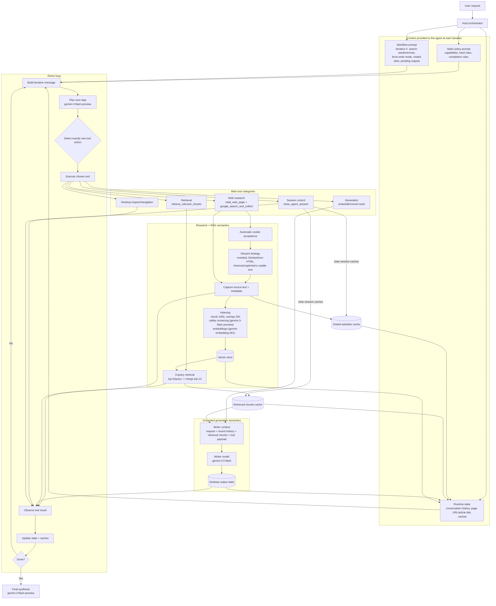

### SCREENRECORDED USE CASES🎬 🎬🎬

[Tutorial Market Competitor Analysis](./resources/CompetitorAnalysis.mp4)

[Tutorial News Research](./resources/Tutorial_News_Research.mp4)


## Blueberry Browser

## What is Blueberry?

Blueberry is a ReAct (Reasoning + Acting) agent that can autonomously conduct web research and execute desktop actions inside a sandboxed folder.

Instead of only generating text, Blueberry follows an execution loop: it reasons about the next best step, calls one tool, observes the result, updates state, and repeats until the task is complete.

## Design Overview

Blueberry is designed as an autonomous research-to-delivery system with clear separation between planning, execution, and safety controls.

1. The planner decides the next action in short iterative steps.
2. The tool layer performs concrete operations (web, retrieval, files, document generation).
3. The runtime tracks state across iterations (visited websites, retrieved context, pending outputs, changed files).
4. The controller enforces guardrails (scope limits, action constraints, recovery logic, completion checks).

This architecture keeps behavior transparent and auditable while still allowing open-ended task execution.

## ReAct Execution Model

Blueberry runs in iterative cycles with explicit tool usage.

1. Read current context and task state.
2. Choose exactly one best next tool action.
3. Execute the tool and capture structured output.
4. Update runtime memory and constraints.
5. Continue until completion criteria are met.

This reduces hallucinated “I did X” claims and ties progress to actual successful tool calls.

## Tooling Capabilities

Blueberry exposes tools across research, retrieval, and desktop execution.

- Web context tools: `read_web_page`, `google_search_and_collect`
- Retrieval tool: `retrieve_relevant_chunks` (uses session-indexed research context)
- Session control: `close_agent_session`
- Desktop inspection: `list_desktop_entries`, `read_desktop_file`, `read_desktop_file_if_exists`
- Desktop mutation: `create_folder`, `edit_desktop_file`, `convert_desktop_file_format`, `delete_desktop_file`
- File generation: `write_txt_file`, `write_markdown_file`, `write_csv_file`, `write_word_file`, `write_excel_file`, `write_pdf_file`, `write_powerpoint_file`, `write_text_file`, `add_file_to_existing_folder`
- UI control for desktop interactions: `show_desktop_view`, `show_desktop_folder`, `click_desktop_folder`, `move_cursor`

## Research and Memory Design

Blueberry does not treat each step as stateless.

- Web collection results are tracked per session.
- Retrieved context is cached and reused for multi-file output flows.
- Additional research is triggered only when needed.
- Search loops are bounded by configurable min/max step budgets.

This allows deeper research without uncontrolled wandering.

## Output and Document Pipeline

Blueberry can produce deliverables in multiple formats with grounded content generation.

- Supports `.docx`, `.xlsx`, `.pdf`, `.pptx`, `.md`, `.txt`, `.csv`
- Uses structured validation and retry logic in document preparation
- Enforces format-specific quality checks before final write
- Supports update and conversion flows for existing files
- Uses atomic replacement for file edits to avoid “delete succeeded, rewrite failed” loss scenarios

## Safety Model

Blueberry is built to act, but with strict execution boundaries.

- Filesystem actions are restricted to a sandbox root
- Required desktop actions cannot be “faked” by text-only responses
- Deletion is tightly controlled and blocked in unsafe flows
- Tool calls are explicit and traceable
- Iteration caps and recovery modes prevent endless loops

## Why this matters

Blueberry is not just a conversational assistant. It is a task-completion agent that can research, decide, act, and produce final artifacts with observable execution and bounded risk.




The above video tutorials show two main blueberry use cases:

### (Strawberry) Competitor Analysis 
It shows how bluebarry can autonomously conduct market competitor analysis and create multiple files using the retrieved information. Specifically, it shows transparently end to end the creation of pdf with structured comparison on strongest and weakest points, and a xlsx file comparing the features of the different products

###  News Research 
It shows how blueberry can autonomously plan, reason and research critically the latest web news from different sources. Especially, it shows how it can explore the files in the sandbox folder (blueberry), in this case, it finds an already exisiting relevant file to the request, it converts the .docx file into a .pdf file format and update the file content with the latest news as user requested


   


## 🚀 Project Setup

### Install
```bash
$ pnpm install
```

### Development
```bash
$ pnpm dev
```

### Python Agent + Chroma Setup
Blueberry now includes a project-local Chroma setup for future vector-search work.

Create the local Python environment, install the Python agent dependencies, and bootstrap a persistent Chroma database in `data/chroma`:

```bash
$ npm run setup:chroma
```

Run a smoke test against the local Chroma store:

```bash
$ npm run chroma:smoke-test
```

The Electron app will automatically prefer `.venv/Scripts/python.exe` on Windows or `.venv/bin/python` on Unix-like systems when launching the Python agent. You can override that with `BLUEBERRY_AGENT_PYTHON`. Document drafting defaults to the main agent model, but you can optionally override the dedicated writer with `BLUEBERRY_AGENT_WRITER_MODEL`.

**Add a Gemini API key to `.env`** in the root folder.

```env
LLM_PROVIDER=gemini
GEMINI_API_KEY=your_gemini_api_key
GEMINI_BASE_URL=https://generativelanguage.googleapis.com/v1beta/openai/chat/completions
LLM_MODEL=gemini-3.1-pro-preview
BLUEBERRY_AGENT_WRITER_MODEL=
# Web search uses DuckDuckGo page scraping from the in-app browser.
# No external search API key is required.
# Compatibility alias is also accepted: BLUEBERRY_AGENT_DESKTOP_FOLDER
BLUEBARRY_AGENT_DESKTOP_FOLDER=BLUEBARRY
BLUEBERRY_CHROMA_PATH=data/chroma
BLUEBERRY_CHROMA_DEFAULT_COLLECTION=blueberry_default
BLUEBERRY_CHROMA_EMBEDDING_MODEL=gemini-embedding-001
BLUEBERRY_AGENT_PYTHON=
# Optional inactivity timeout. Default is 600000 (10 minutes).
BLUEBERRY_AGENT_RUN_TIMEOUT_MS=
```

