### SCREENRECORDED USE CASES🎬 

[Tutorial Market Competitor Analysis](./resources/CompetitorAnalysis.mp4)

[Tutorial News Research](./resources/Tutorial_News_Research.mp4)


## Blueberry Browser

## What is Blueberry?

Blueberry is an agentic RAG system that combines autonomous web research, vector database retrieval, stateful planning, tool execution, and sandboxed file operations into one traceable loop.

It is built for research-to-delivery workflows, where the agent researches, retrieves, reasons, validates, and generates real outputs like PDFs, Word documents, spreadsheets, Markdown files, CSVs, and presentations.

## Design Overview

Blueberry separates planning, retrieval, execution, and reliability controls so each step is tied to a concrete tool call and an observed result.

1. The context builder prepares policy context, workflow context, and session working memory.
2. The planner chooses exactly one next action per ReAct iteration.
3. The tool layer performs concrete operations across web research, retrieval, desktop inspection, and file generation.
4. The runtime updates session working memory after tool execution, including visited sources, retrieved chunks, executed tools, and completed files.
5. The controller enforces guardrails through sandboxed filesystem access, action constraints, retry handling, and completion checks.

This architecture keeps open-ended research workflows transparent while still allowing the agent to produce real deliverables.

## ReAct Execution Model

Blueberry runs in iterative cycles with explicit tool usage.

1. Read current policy, workflow progress, and session working memory.
2. Choose exactly one best next tool action.
3. Execute the tool and capture structured output.
4. Update workflow state and session working memory.
5. Continue until completion criteria are met.

This reduces hallucinated “I did X” claims and ties progress to actual successful tool calls.

Tool calls are wrapped with bounded retry management: failures are observed, retried with constraints, and either recovered via fallback paths or recorded before the next iteration.

## Tooling Capabilities

Blueberry exposes tools across research, retrieval, and desktop execution.

- Web context tools: `read_web_page`, `google_search_and_collect`
- Retrieval tool: `retrieve_relevant_chunks` (uses session-indexed research context)
- Session control: `close_agent_session`
- File generation/edit: `write_txt_file`, `write_markdown_file`, `write_csv_file`, `write_word_file`, `write_excel_file`, `write_pdf_file`, `write_powerpoint_file`, `write_text_file`, `add_file_to_existing_folder`, `edit_desktop_file`, `convert_desktop_file_format`, `create_folder`, `delete_desktop_file`
- Desktop inspection/navigation (read-only): `list_desktop_entries`, `read_desktop_file`, `read_desktop_file_if_exists`, `show_desktop_view`, `show_desktop_folder`, `click_desktop_folder`, `move_cursor`

## Research and Memory Design

Blueberry does not treat each step as stateless. Tool executions modify session working memory, and that memory shapes the next planner decision.

- Web collection results are tracked per session.
- Visited-source memory helps avoid duplicate research.
- Retrieved chunks are cached and reused across multi-file output flows.
- Indexed chunks can be filtered by selected source domains from metadata before retrieval.
- Additional research is triggered only when the current evidence is not enough.
- Search loops are bounded by configurable step limits.

This allows deeper research without uncontrolled wandering.

## Output and Document Pipeline

Blueberry can produce deliverables in multiple formats with grounded content generation.

- Supports `.docx`, `.xlsx`, `.pdf`, `.pptx`, `.md`, `.txt`, `.csv`
- Uses retrieved evidence as context for deliverable generation
- Uses structured validation and retry logic in document preparation
- Enforces format-specific quality checks before final write
- Supports update and conversion flows for existing files
- Uses atomic replacement for file edits to avoid “delete succeeded, rewrite failed” loss scenarios

## Safety Model

Blueberry is built to act, but with explicit operational boundaries.

- Filesystem actions are restricted to a sandbox root
- Required desktop actions cannot be “faked” by text-only responses
- Chunk safety screening uses an LLM guard before web text is embedded into the vector store
- Deletion is tightly controlled and blocked in unsafe flows
- Tool calls are explicit and traceable
- Iteration caps and recovery modes prevent endless loops

## Why this matters

Blueberry makes RAG operational: it does not only retrieve information, it can research, filter, reason, act, validate, and deliver files inside a controlled agentic runtime.

```mermaid
flowchart LR
  U["1) User Request"] --> RUNTIME["2) Agent Runtime / Context Builder"]

  subgraph CP["Governance & Runtime Context"]
    direction TB
    POLICY["Policy Context\ncapabilities, rules, constraints"]
    WORKFLOW["Workflow Context\ntask progress, phase, next needs"]
    STATE["Session Working Memory\nexecuted tools, visited sources, retrieved chunks, completed files"]
  end

  RUNTIME --> POLICY
  RUNTIME --> WORKFLOW
  RUNTIME --> STATE

  subgraph REACT_LOOP["ReAct Iteration (explicit loop)"]
    direction TB
    RB["A) Build iteration message\nfrom policy + workflow + memory"]
    RP["B) Plan exactly one next action\nPlanner model: gemini-3.1-pro-preview"]
    RX["C) Execute one tool call"]
    RO["D) Observe structured tool result"]
    RETRY["Retry Manager"]
    RU["E) Update workflow + memory"]
    RD{"F) Done?"}

    RB --> RP --> RX --> RO --> RU --> RD
    RO -. tool failure .-> RETRY
    RETRY -. retry with constraints .-> RX
    RETRY -. exhausted retries .-> RU
    RD -- "No: next iteration" --> RB
    RD -- "Yes" --> FINAL["Final response / deliverable"]
  end

  POLICY --> RB
  WORKFLOW --> RB
  STATE --> RB

  subgraph EP["Action Layer: Tool Categories (no overlap)"]
    direction TB
    ROUTER["Tool Router"]

    WEB["Web Research Tools\nread_web_page\ngoogle_search_and_collect"]
    RETR["Retrieval Tools\nretrieve_relevant_chunks"]
    FILES["File Generation / Edit Tools\nwrite_txt_file\nwrite_markdown_file\nwrite_csv_file\nwrite_word_file\nwrite_excel_file\nwrite_pdf_file\nwrite_powerpoint_file\nwrite_text_file\nadd_file_to_existing_folder\nedit_desktop_file\nconvert_desktop_file_format\ncreate_folder\ndelete_desktop_file"]
    DESKTOP["Desktop Inspection Tools\nlist_desktop_entries\nread_desktop_file\nread_desktop_file_if_exists\nshow_desktop_view\nshow_desktop_folder\nclick_desktop_folder\nmove_cursor"]
    SESSION["Session Control Tools\nclose_agent_session"]

    ROUTER --> WEB
    ROUTER --> RETR
    ROUTER --> FILES
    ROUTER --> DESKTOP
    ROUTER --> SESSION
  end

  RX --> ROUTER

  subgraph KP["Knowledge & Retrieval Pipeline (RAG)"]
    direction TB

    subgraph INDEX["Indexing Section"]
      direction TB
      EXTRACT["Page extraction + metadata"]
      CHUNK["Chunking\nsize 1000, overlap 200"]
      SAFETY["Chunk safety screening\nLLM guard: gemini-3.1-pro-preview\nprompt-injection / malicious chunk check"]
      EMBED["Embeddings\ngemini-embedding-001"]
      VS[("Vector Store")]

      EXTRACT --> CHUNK --> SAFETY --> EMBED --> VS
    end

    subgraph RETRIEVAL["Retrieval Section"]
      direction TB
      DOMAINS["Source-domain catalog\navailable_source_domains\nfrom chunk metadata"]
      SELECT["Source selection\nselected_source_domains"]
      FILTER["Metadata filter\nload candidates where\nsource_domain is selected"]
      MQR["Multi-query retrieval\n3 queries, top-5 each"]
      PRUNE["Merge + dedupe + relevance prune\nfinal top-12"]

      DOMAINS --> SELECT --> FILTER --> MQR --> PRUNE
    end

    VS --> DOMAINS
    VS --> FILTER
  end

  WEB --> EXTRACT
  RETR --> SELECT

  subgraph GEN["Deliverable Synthesis Pipeline"]
    direction TB
    PLANNER["Planner\ngemini-3.1-pro-preview\nchooses next action"]
    WRITER["Writer\ngemini-2.5-flash\nuses request + retrieved evidence"]
    VALIDATE["Structured output validation"]
    OUT[("Deliverable Artifacts")]

    WRITER --> VALIDATE --> OUT
  end

  RP --> PLANNER
  PLANNER --> ROUTER
  PRUNE --> WRITER

  WEB --> RU
  RETR --> RU
  FILES --> RU
  DESKTOP --> RU
  SESSION --> RU
  VALIDATE --> RU
```




The above video tutorials show two main Blueberry use cases:

### Competitor Analysis 
It shows how Blueberry can autonomously conduct market competitor analysis and create multiple files using retrieved information. Specifically, it shows the end-to-end creation of a PDF with a structured comparison of strongest and weakest points, plus an XLSX file comparing product features.

### News Research 
It shows how Blueberry can autonomously plan, reason, and research the latest news from different sources. It also shows how Blueberry can explore files in the sandbox folder, find an existing relevant file, convert a `.docx` file into a `.pdf`, and update the file content with the latest news requested by the user.


   


## 🚀 Project Setup

### Install
```bash
$ pnpm install
```

### Development
```bash
$ pnpm dev
```

### Python Agent + Chroma Setup
Blueberry includes a project-local Chroma setup for vector-search-backed research memory.

Create the local Python environment, install the Python agent dependencies, and bootstrap a persistent Chroma database in `data/chroma`:

```bash
$ npm run setup:chroma
```

Run a smoke test against the local Chroma store:

```bash
$ npm run chroma:smoke-test
```

The Electron app will automatically prefer `.venv/Scripts/python.exe` on Windows or `.venv/bin/python` on Unix-like systems when launching the Python agent. You can override that with `BLUEBERRY_AGENT_PYTHON`. Document drafting defaults to the main agent model, but you can optionally override the dedicated writer with `BLUEBERRY_AGENT_WRITER_MODEL`.

**Add a Gemini API key to `.env`** in the root folder.

```env
LLM_PROVIDER=gemini
GEMINI_API_KEY=your_gemini_api_key
GEMINI_BASE_URL=https://generativelanguage.googleapis.com/v1beta/openai/chat/completions
LLM_MODEL=gemini-3.1-pro-preview
BLUEBERRY_AGENT_WRITER_MODEL=
# Web search uses DuckDuckGo page scraping from the in-app browser.
# No external search API key is required.
# Compatibility alias is also accepted: BLUEBERRY_AGENT_DESKTOP_FOLDER
BLUEBARRY_AGENT_DESKTOP_FOLDER=BLUEBARRY
BLUEBERRY_CHROMA_PATH=data/chroma
BLUEBERRY_CHROMA_DEFAULT_COLLECTION=blueberry_default
BLUEBERRY_CHROMA_EMBEDDING_MODEL=gemini-embedding-001
BLUEBERRY_AGENT_PYTHON=
# Optional inactivity timeout. Default is 600000 (10 minutes).
BLUEBERRY_AGENT_RUN_TIMEOUT_MS=
```
